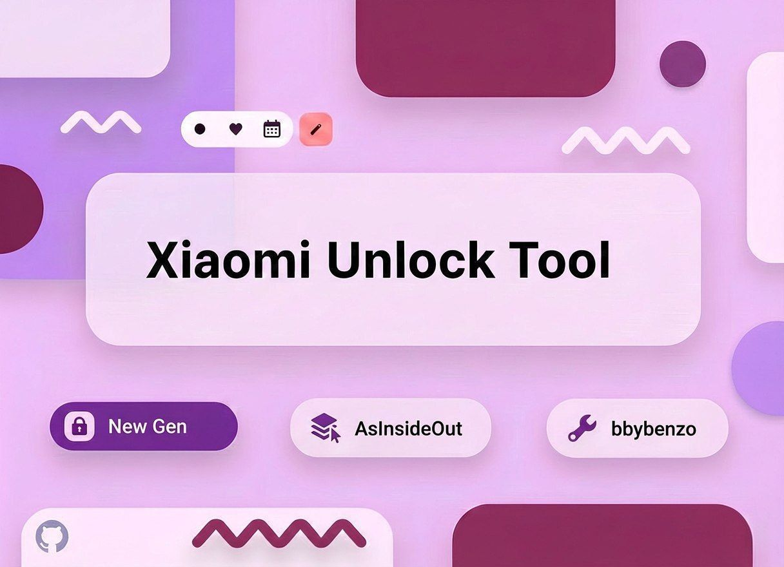

# Xiaomi Unlock Tool

----------ABOUT----------
Xiaomi Unlock Tool is universal program for unlocking bootloader on your Xiaomi/Redmi/Poco phone that runs on HyperOS!
All HyperOS versions work EXCEPT China (CNXM). The tool also can run on Mobile phone or tablet which means you don't need PC!

----------REQUIREMENTS----------
1) Any device
2) New version of the tool itself
3) Pydroid3 for Android phone/tablets

----------INSTRUCTIONS (PC)----------
1) Download new version from Releases page.
2) Unarchive the whole ZIP anywhere.
3) Open "Xiaomi Unlock Tool *.*" (*.* - version number).
4) Read the Welcome text and click "Continue".
5) In the program itself, click "Instructions and Script settings".
6) Click "Getting Cookies" and choose your browser.
7) Follow the tutorial and get "new_bbs_token".
8) Close the instructions window and go to main program.
9) Insert your "new_bbs_token" in the field and click "Start application".
10) Wait for 23:55 in Beijing, the program synchronizes the time again.
11) Wait for 23:59.40, the program will start calculating ping.
12) In 23:59.58 the program sends the request (or spam them if spam is enabled in the settings).
13) In 00:01 (Beijing) you can try to bind your Account in developer settings.
That's it!

----------INSTRUCTIONS (Mobile/Tablet)----------
1) Download new version from Releases page.
2) Unarchive the whole ZIP anywhere.
3) Open "README n CREDITS" file, install everything it says and continue from instructions from step 4 (for pc)
That's it!

Found any issues or have a suggestion? Contact us:
Email: asinsideoutt@gmail.com
Telegram: @hyeplet231 or @miunlocktoolnew
Reddit: u/AsInsideOut
Or create a new issue in "Issues" tab.

Starting from version 5.8 source code can be found in the "Source Code" folder in the project. There will be folders which indicates the version of the script by their names.

//RU

----------О ПРОГРАММЕ----------
Xiaomi Unlock Tool это универсальная программа для разблокировки телефона на вашем Xiaomi/Redmi/Poco!
Программа работает на всех версиях HyperOS КРОМЕ Китайской (CNXM). Программу можно запустить не только на компьютере, но и ещё на телефоне или даже на планшете!

----------ТРЕБОВАНИЯ----------
1) Любое устройство
2) Новая версия программы
3) Pydroid3 для телефона/планшета

----------ИНСТРУКЦИЯ (ПК)----------
1) Скачайте новую версию программы со страницы релизов
2) Разархивируйте всё в одну папку
3) Откройте "Xiaomi Unlock Tool *.*" (*.* - версия скрипта)
4) Прочтите приветственный текст и нажмите "Продолжить"
5) В самой программе нажмите на кнопку "Инструкции и Настройки скрипта"
6) В самом окне нажмите "Получение токена" и выберите ваш браузер 
7) Получите токен следуя инструкции
8) Закройте окно настроек и инструкции и перейдите в главное окно
9) В поле вставьте токен и нажмите "Начать"
10) Подождите до 23:55 (Пекин), время снова синхронизируется
11) В 23:59:40 (Пекин) программа начнёт считать пинг, а в 23:59:58 программа начнёт отправлять запросы (если выбран спам режим)
12) В 00:01 (Пекин) можете попробовать привязать аккаунт в настройках разработчика.
Готово!

----------ИНСТРУКЦИЯ (Андроид)----------
1) Скачайте программу со страницы релизов
2) Разархивируйте асё в одну папку
3) Откройте файл "README n CREDITS", найдите там инструкцию для телефонов и планшетов. Там будет написано что надо установить, сделайте это и начните делать всё тоже самое что я для ПК, начиная с шага 4
Готово!

Нашли баг или у вас есть предложение? Напишите нам:
Почта: asinsideoutt@gmail.com 
Телеграм: @hyeplet231 или @miunlocktoolnew
Реддит: u/AsInsideOut
Или используйте вкладку "Issues"/"Проблемы"

Начиная с версии 5.8 исходный код может быть найден в папке "Source Code". Внутри папки будут другие папки, название которых показывает версию кода. 

Reddit: https://www.reddit.com/r/miunlocktool

Telegram:
https://t.me/miunlocktoolnew

Telegram (English): 
The link was supposed to be here.

Script owner/Владелец скрипта: https://github.com/laminaty68-ctrl

The account that managed English telegram channel has been deleted and we wont be able to upload new versions there. Please refer to Global telegram channel since there is both English and russian languages used.

You can support us using crypto or donationalerts! (All money will be split between developers) //// Вы можете поддержать нас используя криптовалюту/DonationAlerts/Яндекс Чаевые! (все деньги будут поделены между разработчиками)

Crypto (USDT/TON network): UQBCkvXTF-NiT7P8g0G-4oiAdsU81rMWJNYBTxDrbl76FabG

Crypto #2 (Bitcoin/Bitcoin network): bc1qzzt00sk0zdxgskw8xx8cjh4jl69wl7fvlshhsh

DonationAlerts: https://www.donationalerts.com/r/asinsideout

Яндекс Чаевые: https://tips.yandex.ru/guest/payment/3049248
